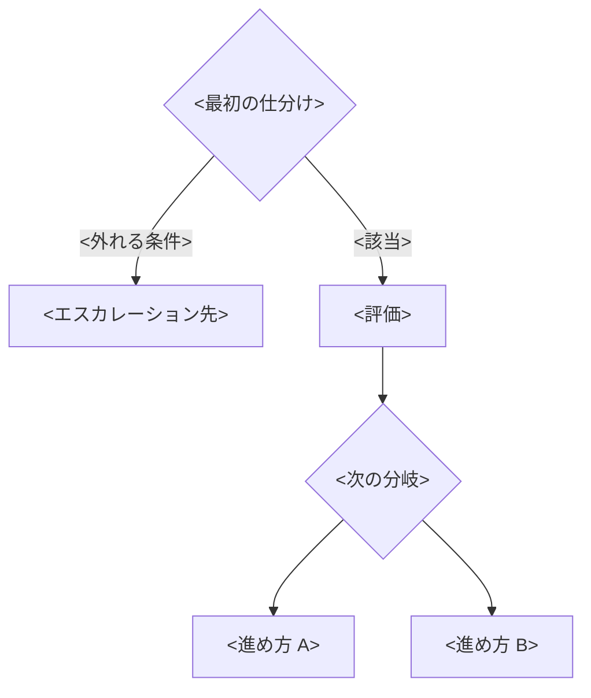

# 規範ドキュメントの骨子テンプレート

型ごとの骨子。節の順序は変えない（目的 → 定義と層 → 収録基準 → いつ使うか → 本体 → 逸脱 → ケーススタディ → 一次ソース）。この順序は「なぜこの文書があるか」を読ませてから規定に入るためのもので、入れ替えると規定だけが読まれて形骸化する。

## 共通

```markdown
# <対象領域>の<型>

## 目的

<誰の・どの判断が・どう揃うか>を1〜2文で書く。

## <型>とは

<型>とは、<対象領域>において<既定として採る方針／判断の型／構造上の方針>である。

- <上位文書>を<この文書の文脈>で具体化したもの
- 基本は守るが、逸脱は例外として記録する
- <この文書が決めること>を決める。<決めないこと>は<別の場所>で扱う

| 層 | 資料 | 決めること |
| --- | --- | --- |
| 判断の型 | <ガイドライン> | どう判断するか |
| 評価の基準 | <設計原則> | 何を良しとするか。技術非依存 |
| 構造の決定 | <本規約> | <何をどう分けるか> |
| 設定値 | <IaC リポジトリ> | 各パラメータの値 |
| 現況 | <システムリファレンス> | いま何がどうなっているか |

### <型>にする基準

次をすべて満たすものだけを<型>にする。

- **上位に接地する**: <守る品質特性／具体化する原則>を言える
- **判断が分かれる**: 従わない選択にも合理性があり、放っておくと設計が分かれる
- **横断する**: どの層で判断しても同じ問いになる。特定の技術・実装・時期を前提にしない
- **繰り返し使う**: 当てはまる判断を2つ以上想定できる
- **他の項目から導けない**: 言い換えや特殊化なら、既存項目の「確認すること」に足す

### <型>にしないもの

- 標準や法令がすでに定めている要件
- 機械的に判定できるルール
- 特定の技術や実装の選択（／個々のパラメータ値）
- 期間を限った方針
- 数値目標（SLO、RPO/RTO）
- <対象領域>以外の判断

### 逸脱の扱い

逸脱してよい。ただし理由を残す。単発の逸脱は<PR／DesignDoc>に理由を書く。同じ逸脱が繰り返されるなら文書が現実に合っていないので、ADR を起こして更新する。

更新条件: <何が起きたら見直すか>

## いつ使うか

### チーム内

- 設計するとき。DesignDoc と ADR の出発点にする
- 判断するとき。都度エスカレーションせず各自が照らして決める
- レビューするとき。指摘の根拠として引く
- 逸脱に気づいたとき。記録する契機にする

### チーム外

- 他チームが<対象領域>に関わる設計をするとき。相談の前に自分で判断できるようにする
- 相談や要望を受けたとき。可否の理由を示し、個別交渉にしない

<本体：型ごとに後述>

## ケーススタディ

<型>を実際の判断に当てはめた事例を置く。逸脱・未決も含める。

| # | 事例と状況 | 引いた項目 | 判断 | トレードオフ・再検討条件 | 記録 |
| --- | --- | --- | --- | --- | --- |
| 1 | **<見出し>**<br><状況> | <3 検証><br><1 独立> | <何を採り、何を捨てたか> | <受け入れた不利益><br>再検討: <条件> | [<ADR / DesignDoc>](<URL>) |

## 一次ソース

- <準拠する標準。どの役割で採るか（プロセス／採点／洗い出し／観点）を添える>
```

## 設計原則の本体

品質特性を軸にする。特性の定義は ISO/IEC 25010 など既存の標準に準拠し、自前で分類を作らない。

```markdown
## 重視する品質特性

<対象領域>は次の特性を重視する。原則はこれらを守るための既定である。特性の定義は ISO/IEC 25010 に準拠する。

- **<特性>**（<副特性>）: <なぜこの領域でこの特性が効くか。破られたとき何が起きるか>

<特性間に優先順位を置くか置かないかを明記する。置かないなら、衝突時にどこで判断するかを書く。>

## 原則

| # | 原則 | 品質特性 | 内容 | 設計で確認すること |
| --- | --- | --- | --- | --- |
| 1 | <動詞で言い切る> | <特性> | <規定>。<守らなかったときに何が起きるか>。 | <Yes/No で答えられる問い> |
```

## 規約の本体

特定技術の文脈で原則を具体化する。値ではなく分け方を決める。

```markdown
## 規約

| # | 規約 | 原則 | 内容 | 設計で確認すること |
| --- | --- | --- | --- | --- |
| 1 | <動詞で言い切る> | <2 最小> | <構造の規定>。<混ぜた／分けたときに何が起きるか>。 | <Yes/No で答えられる問い> |
```

## ガイドラインの本体

判断のフローと仕分けを決める。技術判断と、やるか・いつやるかの判断を必ず分ける。

````markdown
## スコープ

<この文書が型を定める判断の範囲>。技術評価の具体的な基準は<設計原則>に委ね、組織や事業の判断はエスカレーションする。

## 判断の原則

- **<原則名>**: <考え方>
  - <具体の指針>

<競合したときの優先順位を書く。>

## 判断フロー



## 判断の軸

| 軸 | 問い |
| --- | --- |
| <軸> | <この軸で何を確かめるか> |

## エスカレーション

| 論点の型 | 例 | 扱い |
| --- | --- | --- |
| 技術判断 | <例> | <自チームが判断フローに沿って対応> |
| 組織や事業の判断 | <例> | <エスカレーション先> |
````

## 記入時の注意

- **空欄を残さない**。未決なら「未決」と書き、決める場所を指す。空欄は読者に「検討していない」と読まれる。
- **項目名は動詞で言い切る**。名詞の羅列（「可用性」「最小権限」）は規定にならない。
- **「内容」には必ず理由を入れる**。「〜する」で終わらず「〜だから／さもなければ〜になる」まで書く。
- **リンクは記録に張る**。本文で主張の根拠を述べ、詳細は ADR・DesignDoc へ送る。
- **ケーススタディは文書と同じ PR で埋める**。後から書くと埋まらない。
