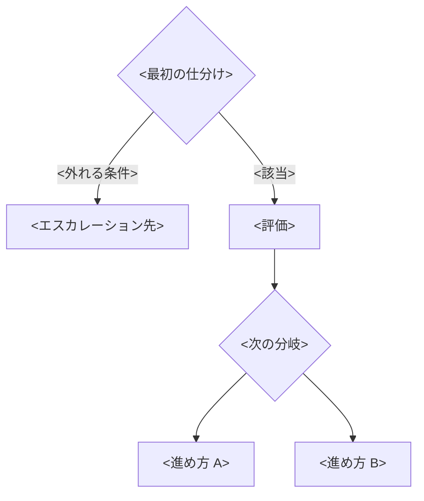

# ガイドラインの骨子テンプレート

節の順序は変えない（目的 → スコープ → 前提 → 原則 → フロー → 軸 → エスカレーション → 成果物 → 適用例 → ケーススタディ → 参考）。目的とスコープを先に読ませないと、手順だけが参照されて例外時に判断できなくなる。

````markdown
# <活動名>ガイドライン

<誰が><何を>一貫した型で進めるためのガイドライン。運用しながら継続的に更新する。

## 目的

<誰の・どの活動が・どう揃うか>を1〜2文で書く。

## スコープ

<このガイドラインが型を定める範囲>を定める。技術評価の具体的な基準は<設計原則>に委ね、組織や事業の判断は[エスカレーション](#エスカレーション)する。

扱わないこと: <明示的に範囲外とするもの>

## 用語

<独自語を作らず、既存の標準・フレームワークの語に接地する。どの標準から借りたかを添える。>

| 用語 | 定義 | 例 |
| --- | --- | --- |

## 前提を揃える

<対象を説明できない状態で進めると列挙が浅くなる。着手前に次を揃える。>

- **<前提>**: <何を確認するか。無ければこの機会に作る>

## <活動>の原則

<進め方の背骨となる考え方。手順ではなく、例外に出会ったときに立ち返る判断の拠り所。>

- **<原則名>**: <考え方>
  - <具体の指針>

<競合したときの優先順位を書く。>

## フロー

<入口から出口までの型。各ステップの詳細は以降の節で扱う。>



<図の直後に、各終端で誰が何を決めるかを文章で書く。>

## 判断の軸

<対象に依らない少数の汎用の軸。領域固有の具体は設計原則で定める。>

| 軸 | 問い |
| --- | --- |
| <軸> | <この軸で何を確かめるか> |

## エスカレーション

論点が<自チームの判断>か<組織や事業の判断>かをまず見分ける。

| 論点の型 | 例 | 扱い |
| --- | --- | --- |
| <技術判断> | <例> | <自チームがフローに沿って対応> |
| <組織や事業の判断> | <例> | <役割名>にエスカレーション |

## 成果物

<各ステップの出力。コピーして使えるテンプレートと記入例を置く。>

**テンプレート**（コピーして使う）:

| # | <列> | <列> | <列> |
| --- | --- | --- | --- |
| 1 | <記入例> | <記入例> | <記入例> |

## 適用例

<架空でよいので、入口から成果物まで通した例。表が埋まった状態を見せて粒度を伝える。>

## ケーススタディ

実際の対応を、フローのどの経路を通って結論に至ったかで示す。

| 案件 | 状況 | フロー経路 | 結論 |
| --- | --- | --- | --- |
| [<Issue>](<URL>) | <状況> | <仕分け → 評価（軸）→ 進め方> | <結論> |

## 更新条件

<何が起きたら見直すか。>

## 参考

- <借りたフレームワーク。どの役割で採るか（プロセス／採点／洗い出し／観点）を添える>
````

## 記入時の注意

- **手順の前に目的とスコープを置く**。順序を入れ替えると、手順だけが参照されて例外時に判断できなくなる。
- **フローは分岐を3〜4に抑える**。細かい条件は分岐にせず、各ステップの本文で扱う。
- **エスカレーション先は役割で書く**。個人名は異動で腐る。
- **空欄を残さない**。未定なら「未定」と書き、決める場所を指す。
- **テンプレートには記入例を1行入れる**。空の表だけでは粒度が伝わらない。
- **ケーススタディは経路を必ず書かせる**。経路を書けない案件が続いたら、フローが現実と合っていない。
