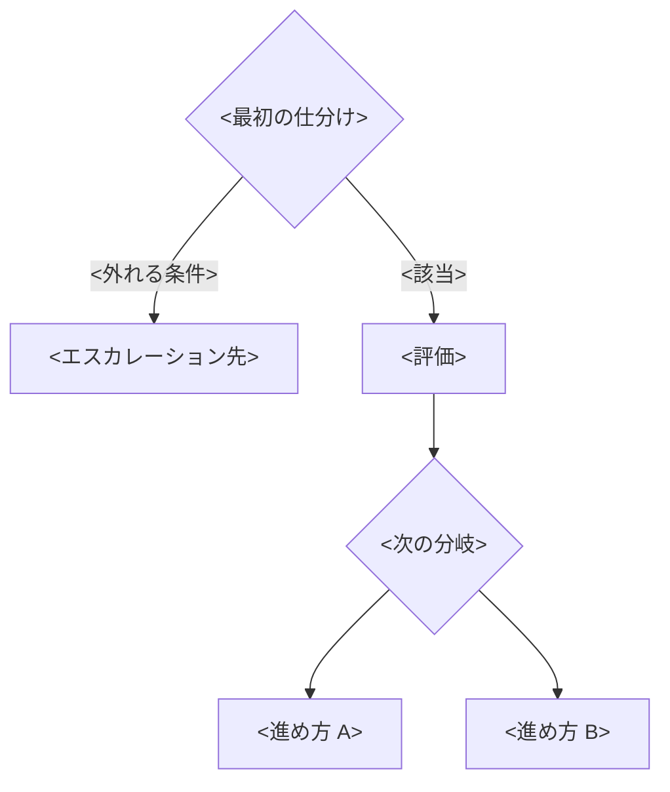

# ガイドラインの骨子

アウトラインと、各節に何を書くかの説明。文例はあくまで一例であり、**書く対象は節ごとの「書くこと」で判断する**。

## アウトライン

```markdown
# <活動名>ガイドライン

## 目的
## スコープ
## 用語
## 前提を揃える
## <活動>の原則
## フロー
## 判断の軸
## エスカレーション
## 例外の扱い
## 成果物
## ケーススタディ
## 更新条件
## 参考
```

節の順序は変えない。目的とスコープを先に読ませないと、手順だけが参照されて例外の場面で判断できなくなる。

| 節 | 答える問い |
|---|---|
| 目的 | このガイドラインがあると何が揃うか |
| スコープ | 何を決め、何を委ね、何を扱わないか |
| 用語 | どの語をどの意味で使うか |
| 前提を揃える | 着手前に何が分かっていればよいか |
| <活動>の原則 | 手順に無い場面で何に立ち返るか |
| フロー | 入口から出口までどう進むか |
| 判断の軸 | 何を見て評価するか |
| エスカレーション | 自分たちで決めないのはどれか |
| 例外の扱い | フローに乗らないときどうするか |
| 成果物 | 各ステップで何を出すか |
| ケーススタディ | 実際にどの経路を通ったか |
| 更新条件 | 何が起きたら見直すか |
| 参考 | どこから骨格を借りたか |

## 各節に何を書くか

### 目的

**書くこと**: このガイドラインを引くことで、誰の・どの活動が・どう揃うかを1〜2文で書く。

**判断の基準**: 目的が「品質を向上させる」のように測れない言葉になっていないか。このガイドラインを引いて進めたい実例を3つ挙げられるなら、目的は十分に絞れている。

**書かないこと**: 手順の要約。それはフローの節で足りる。

### スコープ

**書くこと**: 決めること（活動の進め方）・委ねること（何を良しとするかの基準は設計原則へ）・扱わないことの3つ。

**判断の基準**: 読者が「このガイドラインだけを読んで最後まで進めるのか、途中で別の文書を見るのか」を判別できるか。扱わない範囲が書かれていないと、書かれていないことが「まだ決めていない」のか「意図的に範囲外なのか」を読者が区別できない。

### 用語

**書くこと**: この活動で使う語の定義。**独自語を作らず、既存の標準・フレームワークの語に接地する**。借りた出典を添える。

**判断の基準**: 定義した語が本文で実際に使われているか。本文に出てこない語を並べていないか。

**書かないこと**: 一般的な技術用語の辞書的説明。読者の前提知識で足りるものは省く。

### 前提を揃える

**書くこと**: 着手前に揃えておく情報と、揃っていないときに何をするか。対象の目的・構成・既存の状況・過去の事例など。

この節がないと、対象を説明できないまま作業が始まり、最初の列挙が浅くなって以降のすべてが的を外す。**揃っていなければその機会に作る**ことを明記する。

**判断の基準**: 挙げた前提のそれぞれについて、「無いまま進むと何が起きるか」を言えるか。言えない前提は要らない。

### <活動>の原則

**書くこと**: 手順の背骨となる考え方。手順に無い場面に出会ったときに立ち返る拠り所を、3つ前後に絞る。

複数の原則が競合したときの優先順位を明記する。優先順位を書かないと、競合の場面でその都度議論に戻る。

**判断の基準**: 各原則が、フローのどの分岐や判断を支えているかを言えるか。支えていない原則は飾りになる。

**書かないこと**: 何を良しとするかの技術的な基準。それは設計原則に委ねる。

### フロー

**書くこと**: 入口から出口までの型。分岐つきの図と、各終端で誰が何を決めるかの文章。

- **入口と記録先を一箇所に固定する**（どこで受け付け、やりとりと結論をどこに残すか）
- 分岐は **判断の主体・重さが変わる点** に置く。手順の細かさで分岐させない
- **結論が否定になる終端ほど、返す内容の書式を決める**（理由・将来の可能性・代替経路）

**判断の基準**: 分岐が3〜4に収まっているか。過去の実際の対応を3件、この図の上でなぞれるか。

**書かないこと**: 図だけを置いて説明を省くこと。図の直後に、入力・出力・決定者を文章で書く。

### 判断の軸

**書くこと**: 評価の観点を、対象に依存しない少数の軸として表にする。各軸には「この軸で何を確かめるか」の問いを添える。

**判断の基準**: 軸が対象（設計・実装・運用・相談）を問わず使えるか。特定の対象でしか使えない軸は、軸ではなく手順の一部である。

**書かないこと**: 領域固有の技術基準。設計原則へリンクする。ここに書き込むと、領域が増えるたびに肥大し原則と二重管理になる。

### エスカレーション

**書くこと**: 自分たちで決める論点と、上げる論点の見分け方。型・例・扱いの表にする。

**技術判断（妥当か・どう作るべきか）と対応コミット（やるか・いつやるか）を分ける**。技術的に妥当でも引き受けるかは別の判断であり、混ぜると技術的な結論が組織の都合で歪む。

**判断の基準**: エスカレーション先が役割で書かれているか（個人名は異動で腐る）。上げたあと誰が答えを返すかまで決まっているか。

### 例外の扱い

**書くこと**: フローに乗らない案件が出たときの受け止め方。

- フロー外で進めてよい条件と、そのとき誰に知らせるか
- フロー外で進めたときに何を残すか（経路の代わりに、乗せなかった理由）
- 同じ型の例外が繰り返されたらどうするか（更新条件につなぐ）

**判断の基準**: 例外を禁止していないか。禁止されたガイドラインは、急ぐ場面で黙って飛ばされ、そのまま使われなくなる。

### 成果物

**書くこと**: 各ステップの出力を、コピーして使える表・雛形として置く。列がそのままチェック項目になるように設計する。

**記入例を1行入れる**。空の表だけでは粒度が伝わらず、書く人によって詳しさがばらつく。

**判断の基準**: このテンプレートを埋めれば次のステップに進めるか。埋めても情報が足りないなら列が不足している。

### ケーススタディ

**書くこと**: 実際の対応を、フローのどの経路を通って結論に至ったかで示す。案件・状況・フロー経路・結論。

**経路を書かせること自体が、フローが現実と合っているかの検証** になる。公開後は判断のたびに追記する。

**判断の基準**: 経路を書けない案件が続いていないか。続いているならフローが現実と合っていない。

### 更新条件

**書くこと**: 何が起きたら見直すかを具体的に書く。経路に乗らない案件が2回、委ねている原則の改訂、体制の変更など。

**判断の基準**: 「運用しながら継続的に更新する」だけで終わっていないか。条件が書かれていない文書は更新されない。

### 参考

**書くこと**: 借りた標準・フレームワークと、**どの役割で採ったか**（プロセス／採点／洗い出し／観点）。骨格から外した部分は外した理由も書く。

**判断の基準**: 複数の標準を引いたとき、読者がどれに従えばよいか迷わないか。役割が書かれていないと責務が重なる。

## 共通の書き方

- **空欄を残さない**。未定なら「未定」と書き、決める場所を指す。
- **エスカレーション先は役割で書く**。個人名は異動で腐る。
- **手順の前に目的とスコープを置く**。順序を入れ替えると、手順だけが参照されて例外の場面で判断できなくなる。
- **テンプレートには記入例を1行入れる**。
- **ケーススタディは経路を必ず書かせる**。

## 記入例

一例であり、この書き方に合わせる必要はない。

````markdown
## フロー



<図の直後に、各終端で誰が何を決めるかを文章で書く。>

## 判断の軸

| 軸 | 問い |
| --- | --- |
| <軸> | <この軸で何を確かめるか> |

## エスカレーション

| 論点の型 | 例 | 扱い |
| --- | --- | --- |
| <自チームの判断> | <例> | <フローに沿って対応> |
| <組織や事業の判断> | <例> | <役割名>にエスカレーション |

## ケーススタディ

| 案件 | 状況 | フロー経路 | 結論 |
| --- | --- | --- | --- |
| [<Issue>](<URL>) | <状況> | <仕分け → 評価（軸）→ 進め方> | <結論> |
````
